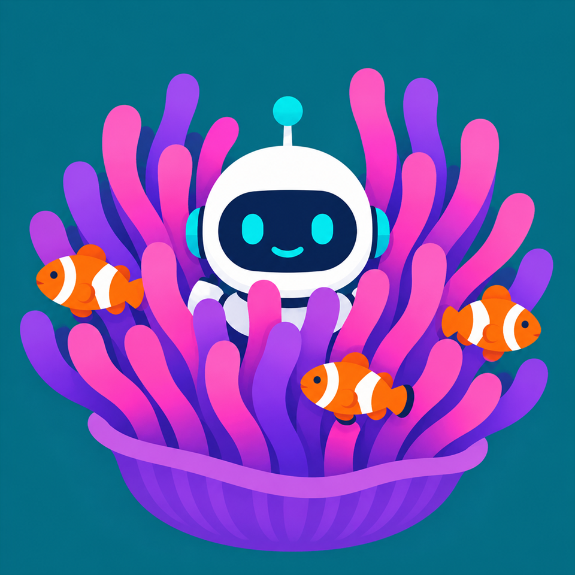
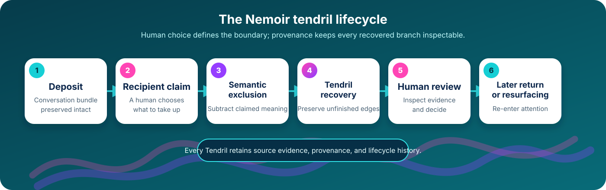

<p align="center">
  
</p>

<h1 align="center">Nemoir</h1>

<p align="center"><strong>Preserve the worthwhile conversational branches that nobody meaningfully took up.</strong></p>

<p align="center">
  <a href="CONCEPT.md">Concept</a> ·
  <a href="docs/TECHNICAL.md">Technical guide</a> ·
  <a href="CONTRIBUTING.md">Contributing</a> ·
  <a href="SECURITY.md">Security</a>
</p>

Nemoir turns unfinished conversational edges—questions, disagreements,
research leads, decisions, and project seeds—into reviewable **Tendrils** that
retain their source evidence and can return when they are useful.

Discord is the current reference surface, not the product boundary. The durable
idea is the claim-relative tendril model: human choice defines what is already
being answered, claimed meaning is excluded, and worthwhile material in the
remainder is preserved without pretending every topic is a task.



## The essential idea

1. Someone deliberately deposits a conversation bundle.
2. The recipient claims what they intend to take up.
3. Nemoir excludes the meaning covered by that claim.
4. Source-backed Tendrils are recovered from the meaningful remainder.
5. A human reviews the result.
6. Open Tendrils can be resurfaced later with their provenance intact.

The original conversation is never rewritten, model interpretations do not
become authority, and claimed material must not reappear as an independent
Tendril. Read the [implementation-independent concept](CONCEPT.md) for the full
model and invariants.

## Try the offline demonstration

The deterministic demo uses synthetic material and makes no Discord or paid
model-provider calls:

```powershell
py -3.10 -m venv .venv
.\.venv\Scripts\python.exe -m pip install -e ".[dev]"
.\.venv\Scripts\python.exe -m nemoir demo-offline --database data\demo.sqlite3
```

Nemoir is an experimental reference implementation, not a production service.
Real deployments can persist sensitive conversation content, identifiers,
source links, and provider output. Never commit credentials, databases, logs,
or private conversations.

## Dig deeper

| If you want to… | Start here |
| --- | --- |
| Understand what makes Nemoir distinct | [Concept and invariants](CONCEPT.md) |
| Install, configure, or operate the reference implementation | [Technical guide](docs/TECHNICAL.md) |
| Understand the code boundaries | [Repository map](docs/TECHNICAL.md#repository-map) |
| Work on the project | [Contributing guide](CONTRIBUTING.md) |
| Report a vulnerability or protect sensitive data | [Security policy](SECURITY.md) |
| Reuse the artwork or bot avatar | [Visual assets](docs/assets/README.md) |

The reusable domain and application core live under `src/nemoir/`; Discord,
model providers, SQLite, and the Windows control panel are replaceable
reference adapters and surfaces.

## Attribution and licence

The original Nemoir concept is attributed to **Thom Finlayson**. Nemoir is
licensed under the [Apache License 2.0](LICENSE); see [NOTICE](NOTICE) and
[CITATION.cff](CITATION.cff) for attribution and citation details.
